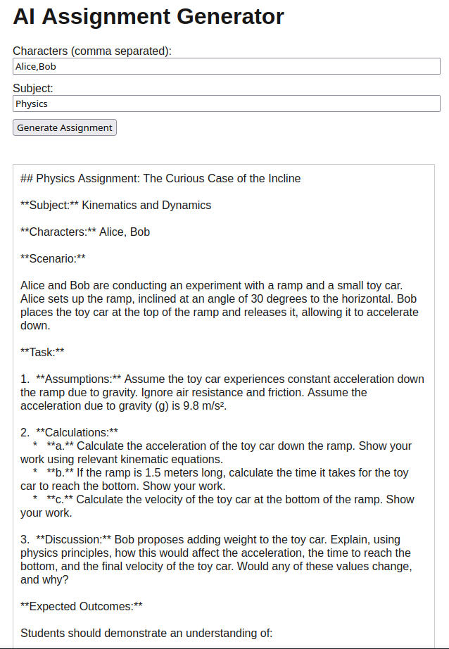
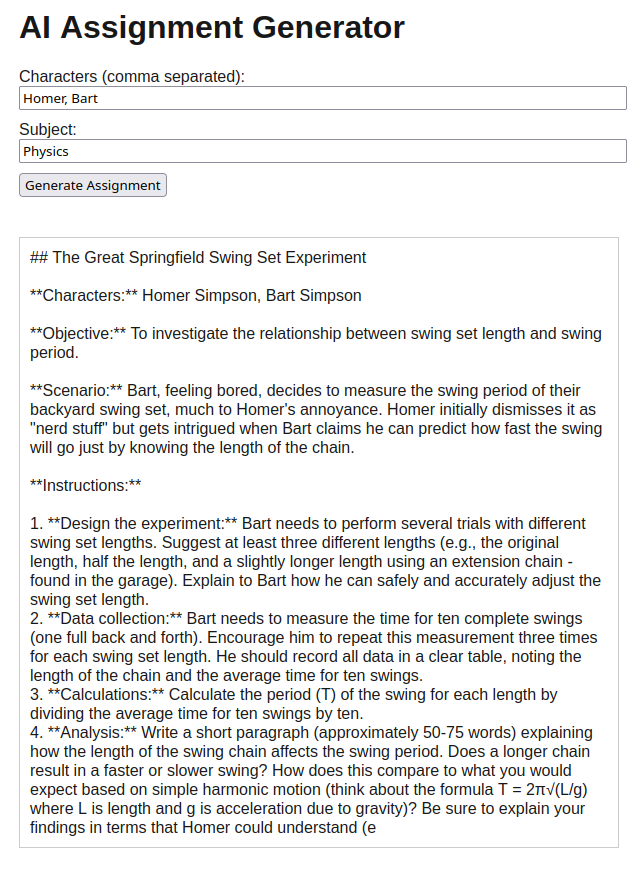
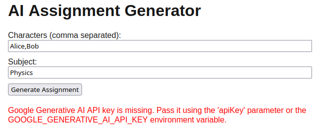

# N317 Exam

[Vercel Link](https://n317-homework04.vercel.app)

Modified Prompt: `Create a short (about 240 words) assignment in the ${genre} subject using these characters: ${characters.join(", ")}. Include instructions and expected outcomes.`

I updated the CSS by increasing the header font size.

The AI SDK works by allowing the developer to provide their api key and send a prompt. The prompt will take up a certain amount of tokens that the user has, depending on the amount of words generated.

In this code specifically, the AI SDK is being provided a prompt to create an assignment description in a given subject, provided by the user and passed through with a variable. Additionally, the "characters" in the assignment are also the result of user input.

## Screenshots:

